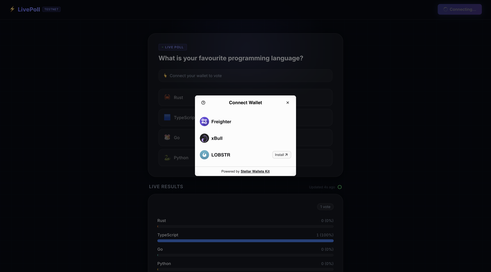
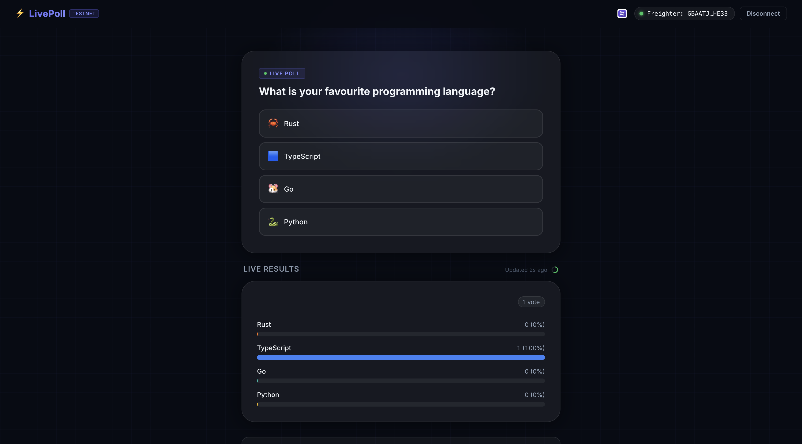
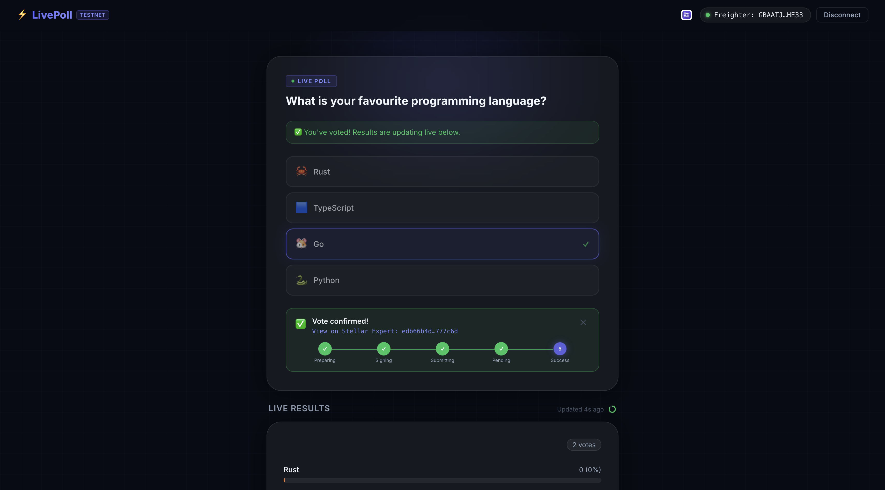
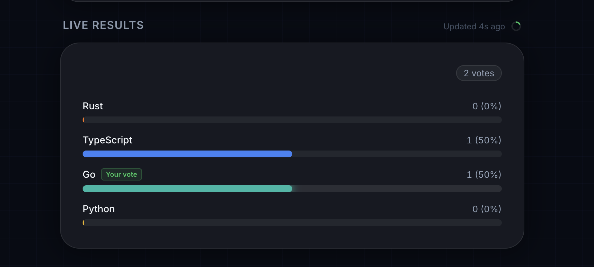

# PollWithStellar

A decentralized polling dApp built for the Stellar Testnet. Connect your wallet to cast on-chain votes and view real-time results. This repo includes the complete interactive frontend, seamless wallet integration, and robust error handling pages to ensure a smooth Web3 experience. Ideal for exploring Stellar smart contract integrations.

# ⚡ LivePoll — Decentralised Voting on Stellar Soroban

A real-time live poll dApp built on **Stellar Soroban testnet**. Connected wallets vote on a single question and results update live for all viewers every 5 seconds.

## Screenshots

**1. Wallets Available**


**2. After Connection**


**3. Polling Done**


**4. Real-time Results (Updates every 5 seconds)**


**[Live Link](https://disasterreliefrail.vercel.app/)

---

## What It Does

- A single-question poll with 4 options: **Rust**, **TypeScript**, **Go**, **Python**
- Connected Stellar wallets can cast exactly one vote
- Results are shown as animated percentage bars, auto-refreshing every 5 seconds
- All votes are verifiably recorded on-chain via a Soroban smart contract

---

## Contract

| Item | Value |
|------|-------|
| Network | Stellar Testnet |
| Contract ID | `CBJKPJ5CNQSLTVHV7AB6G5CZBJOD5HPSBDKO2WR6RJAAQPZZIXSGNXZO` |
| Explorer | [View on Stellar Expert](https://stellar.expert/explorer/testnet/contract/CBJKPJ5CNQSLTVHV7AB6G5CZBJOD5HPSBDKO2WR6RJAAQPZZIXSGNXZO) |
| Deployer | `GAGQNYTIAVTZP6U3GOW3TUZ344UFOEKNZGRC6E2TWZ22PGAPL56Y3WRT` |

The contract ID above will be filled in after deployment.

---

## Project Structure

```
Live Poll/
├── contract/          # Soroban smart contract (Rust)
│   ├── Cargo.toml
│   └── src/
│       └── lib.rs     # init, vote, get_results, has_voted
├── frontend/          # React + Vite app
│   ├── src/
│   │   ├── App.jsx
│   │   ├── index.css
│   │   ├── components/
│   │   │   ├── WalletConnect.jsx
│   │   │   ├── PollCard.jsx
│   │   │   ├── ResultsChart.jsx
│   │   │   └── TxStatus.jsx
│   │   └── lib/
│   │       ├── contract.js  # Stellar SDK contract calls
│   │       ├── wallet.js    # StellarWalletsKit integration
│   │       └── errors.js    # Error classification
│   └── .env.example
└── README.md
```

---

## How to Run Locally

### Prerequisites

- Node.js 20+ (via nvm)
- Rust + `wasm32-unknown-unknown` target
- Stellar CLI (`cargo install stellar-cli`)
- Freighter or xBull browser extension

### 1. Deploy the Contract (one-time)

```bash
cd contract

# Build the WASM
cargo build --release --target wasm32-unknown-unknown

# Optimize
stellar contract optimize --wasm target/wasm32-unknown-unknown/release/live_poll.wasm

# Generate and fund a testnet key
stellar keys generate deployer --network testnet
stellar keys fund deployer --network testnet

# Deploy
stellar contract deploy \
  --wasm target/wasm32-unknown-unknown/release/live_poll.optimized.wasm \
  --source deployer \
  --network testnet

# Initialise with your poll question (replace CONTRACT_ID)
stellar contract invoke \
  --id CONTRACT_ID \
  --source deployer \
  --network testnet \
  -- init \
  --question "What is your favourite programming language?" \
  --options '["Rust","TypeScript","Go","Python"]'
```

### 2. Run the Frontend

```bash
cd frontend

# Copy env template and add your contract ID
cp .env.example .env
# Edit .env: VITE_CONTRACT_ID=your_contract_id_here

npm install
npm run dev
```

Open http://localhost:5173

---

## Supported Wallets

| Wallet | Extension | Notes |
|--------|-----------|-------|
| **Freighter** | [freighter.app](https://www.freighter.app/) | Recommended |
| **xBull** | [xbull.app](https://xbull.app/) | Supported |
| **Lobstr** | [lobstr.co](https://lobstr.co/sign/) | Supported |

---

## Error Handling & Toast History

Three specific error types are surfaced in the UI as **persistent toast notifications** in the bottom right corner (useful for demoing errors in sequence):

| # | Error | How to Trigger | Message |
|---|-------|---------|---------|
| 1 | **Wallet Not Found** | Open the dApp in an incognito window or a browser without Freighter installed, then click Connect. | "Wallet extension not found. Please install Freighter or xBull and refresh." |
| 2 | **User Rejected** | Click Connect or Vote, then click **Reject** in the Freighter popup. | "Vote cancelled — you rejected the request in your wallet" |
| 3 | **Insufficient Balance** | Connect an unfunded testnet wallet (0 XLM) and try to vote. | "Insufficient balance to cover transaction fee" (with a link to Friendbot) |

---

## How Real-Time Updates Work

- **Polling with Visual Indicator**: The frontend calls `get_results()` on the smart contract **every 5 seconds**. A visual circular progress ring in the "Live Results" section shows exactly when the next refresh will happen.
- **Timestamp**: A "Last updated Xs ago" timer ticks up every second.
- **Smooth Animations**: When results change, the percentage bars animate smoothly (`transition: width 0.8s ease-out`) instead of snapping.
- **Gas-free Reads**: Calls are **simulated** (read-only) using `rpc.Server.simulateTransaction()` — no fee for polling.

---

## Transaction Status Flow

Votes go through a clear status progression shown in the UI:

```
Preparing → Signing → Submitting → Pending → ✅ Success (with tx hash + Explorer link)
                                           ↘ ❌ Failed (with reason)
```

---

## Development

```bash
# Run contract tests
cd contract && cargo test

# Build frontend for production
cd frontend && npm run build
```
